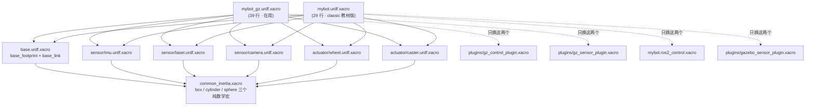
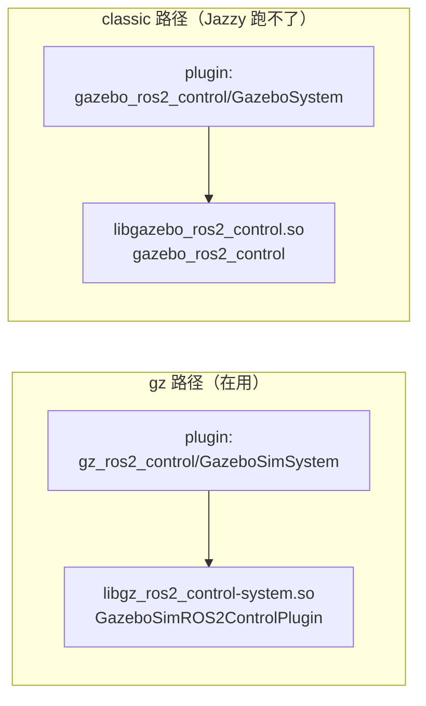
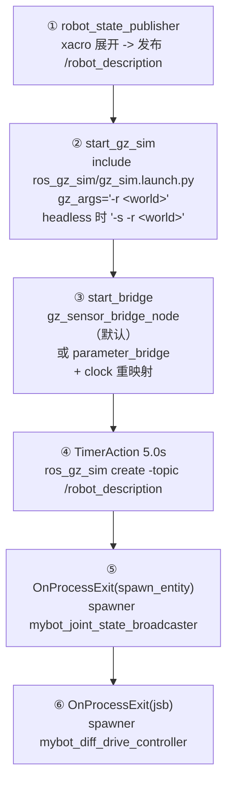

# 模块详解 · `mybot_description`

> 这份文档回答一个问题：**怎么把 `mybot_description` 真正搞懂**。
>
> 配套材料（按需查，不要重复读）：
> - [`模块清单.md`](模块清单.md) —— 这个包干什么 / 怎么跑 / 验证到什么程度
> - [`模块解剖.md`](模块解剖.md) —— 这个包对外什么接口、和谁交互
> - [`上手路线.md`](上手路线.md) —— 项目级的 L1–L5 掌握模型
> - [`问题记录.md`](问题记录.md) —— 踩过的坑
>
> 本文件是**模块级**的：只讲 `mybot_description`，而且重点是**自己怎么验证**，
> 不是「把结论背下来」。
>
> **第一次看这份文档的话，先读[第零节](#第零节零基础七步)就够了。**
> 后面第一到十三节是「参考手册」，等你卡住了再回头查。

---

## 第零节：零基础七步

> 这一节假设你**还不熟悉 ROS 2**。每一步都是：**做什么 → 敲什么 → 看到什么 →
> 说明什么**。文中所有「看到什么」都是**实测输出**，不是示意。
>
> **建议先自己敲一遍**，敲完再用下面两个脚本对照：
>
> ```bash
> # 第 0~5 步：只读，不改任何文件，随时可跑
> ./scripts/shell.sh -c 'bash /workspace/my-slam/tools/walk_mybot_description.sh'
>
> # 第 6 步：会临时改源文件，自带备份与还原
> ./scripts/shell.sh -c 'bash /workspace/my-slam/tools/walk_mybot_description_step6.sh apply'
> #   -> 重启仿真
> ./scripts/shell.sh -c 'bash /workspace/my-slam/tools/walk_mybot_description_step6.sh measure'
> ./scripts/shell.sh -c 'bash /workspace/my-slam/tools/walk_mybot_description_step6.sh restore'
> ```
>
> `step6` 支持 `status` / `apply` / `measure` / `restore` 四个子命令。
> **做完一定要 `restore`**（`status` 会提示你有没有残留备份）。

### 先记住三个词

| 词 | 一句话 |
| --- | --- |
| **xacro / URDF** | 机器人长什么样的**文字描述**。xacro 是「带变量的模板」，URDF 是展开后的结果 |
| **话题（topic）** | 节点之间传数据的「频道」。可以问「谁在发（publisher）」「谁在收（subscriber）」 |
| **TF** | 坐标系之间的相对位置关系。「雷达在底盘上方 15cm」就是一条 TF |

以及一个贯穿全文的关键区分 —— **同一个机器人存在两份**：

- **ROS 侧**：URDF、TF、`/cmd_vel`
- **GZ 侧**：物理引擎、`/scan`、`/imu`

> 命令都从 `my-slam/` 目录下执行（也就是 `./scripts/...` 能跑的那个目录）。

### 第 0 步 · 确认环境

```bash
./scripts/shell.sh -c 'echo $ROS_DISTRO; ros2 pkg prefix mybot_description'
```

实测输出：

```
jazzy
/workspace/my-slam/install/mybot_description
```

两行都出来 = 环境正常。**只出 `jazzy`、第二行报错** = 没 source，加上
`source /workspace/my-slam/install/setup.bash`。

### 第 1 步 · 把 xacro 展开成人能看的 URDF

xacro 里有变量和宏，在脑子里做展开太累。**让电脑展开给你看。**

```bash
cd src/robot/mybot_description
xacro urdf/mybot/mybot_gz.urdf.xacro > /tmp/m.urdf
check_urdf /tmp/m.urdf
```

实测输出：

```
生成 /tmp/m.urdf ，行数 = 472

robot name is: mybot
---------- Successfully Parsed XML ---------------
root Link: base_footprint has 1 child(ren)
    child(1):  base_link
        child(1):  back_caster_link
        child(2):  camera_link
            child(1):  camera_optical_link
        child(3):  front_caster_link
        child(4):  imu_link
        child(5):  laser_cylinder_link
            child(1):  laser_link
        child(6):  left_wheel_link
        child(7):  right_wheel_link
```

**这棵树就是这个机器人的全部结构**：`base_link`（身体）下面挂了 7 样东西 ——
2 个万向轮、相机、IMU、雷达（带一根杆）、2 个驱动轮。**记住 7 这个数**。

> 💡 **优化点**：`/tmp/m.urdf` **留在那儿别删**。以后查任何尺寸，`grep` 这个文件
> 比重读 xacro 快得多（472 行 vs 779 行，而且没有宏）。

### 第 2 步 · 起仿真，确认它真的活着

```bash
./scripts/sim.sh --headless --clean
```

`--headless` = 不开窗口。**新手建议用它**：起得快、不会因为显卡出问题。

**另开一个终端**，用三个判据确认：

```bash
./scripts/shell.sh -c 'pgrep -af "gz[ ]si[m]"'                    # 判据1：进程在
./scripts/shell.sh -c 'ros2 topic info /scan | grep Publisher'    # 判据2：有人在发数据
./scripts/shell.sh -c 'gz model --list'                           # 判据3：机器人生成出来了
```

实测输出：

```
判据1:  2796 gz sim -s -r -v 1 .../custom_room_gz.world
判据2:  Publisher count: 1
判据3:  Available models:
            - ground_plane
            - room
            - mybot          <- 有它
```

三个都齐 = 仿真真的在跑。
**只有判据1 有、判据3 里没有 `mybot`** = gz 起了但模型没生成进去（常见原因：
`robot_state_publisher` 没起来）。

### 第 3 步 · 看 TF 树 —— 把这步做透，你就懂一半了

TF 分**静态**（不变）和**动态**（会变）两个话题。分开看，一眼就能看出「谁在动」。

```bash
./scripts/shell.sh -c 'ros2 topic echo /tf_static --once | grep child_frame_id'
./scripts/shell.sh -c 'timeout 4 ros2 topic echo /tf | grep child_frame_id | sort -u'
```

实测输出：

```
/tf_static（静态）—— 8 个：
  back_caster_link
  base_link
  camera_link
  camera_optical_link
  front_caster_link
  imu_link
  laser_cylinder_link
  laser_link

/tf（动态）—— 3 个：
  base_footprint
  left_wheel_link
  right_wheel_link
```

**这是全篇最有价值的一段**：

| 疑问 | 答案 |
| --- | --- |
| 为什么**轮子**不在静态里？ | 它们的关节是 `continuous`（会转），所以是动态的 |
| 为什么 `base_footprint` 不在静态里？ | 它相对 `odom` 会移动，所以是动态的 |
| 为什么**没有 `odom`**？ | 它在更上游，**不是** `robot_state_publisher` 发的，是差速控制器发的 |

> **新手最容易卡的点**：以为「URDF 里的结构 = 全部 TF」。
> 不是。URDF 只管 `base_footprint` 往下那一段，
> `odom → base_footprint → 地图` 全是别的节点在贡献。
>
> **验证方法**：`check_urdf` 的树里有 9 个 link，而 `/tf_static` 只有 8 条。
> 差的那些，就是「别人在发」的部分。

### 第 4 步 · 问 TF 一个具体问题

不读任何文件，直接问「雷达相对底盘在哪」：

```bash
./scripts/shell.sh -c 'timeout 12 ros2 run tf2_ros tf2_echo base_link laser_link'
```

实测输出：

```
- Translation: [0.000, 0.000, 0.150]
- Rotation: in RPY (radian) [0.000, -0.000, 0.000]
```

雷达在底盘**正上方 15cm**，没有旋转。这个数来自 `laser_xacro xyz="0 0 0.10"`（杆）
+ `laser_joint z=0.05` → `0.10 + 0.05 = 0.15` ✓

> ⚠️ **新手会以为出错了**：第一次运行常看到
> `Invalid frame ID "base_link" ... frame does not exist`。
> **这是正常的**（TF 数据还没收全），等 1~2 秒会自己出结果，**不是错误**。

### 第 5 步 · 看「两侧话题」

```bash
./scripts/shell.sh -c 'ros2 topic list | head -25'
./scripts/shell.sh -c 'gz topic -l | head -25'
```

实测对照片段：

| ROS 侧 | GZ 侧 |
| --- | --- |
| `/scan`、`/scan/points` | `/scan`、`/scan/points` |
| `/imu` | `/imu` |
| `/camera/image` | `/camera/image` |
| `/joint_states`、`/odom`、`/cmd_vel` | （无） |
| （无） | `/world/default/scene/info`、`/stats`、`/sensors/marker` |

- **两侧都有**的（`/scan`、`/imu`、`/camera/*`）→ 靠**桥**连通
- **只有 ROS 有**的（`/odom`、`/cmd_vel`、`/joint_states`）→ ROS 自己算出来的
- **只有 GZ 有**的（`/stats` 等）→ gz 内部话题，ROS 不需要

亲手看到「一个量存在两份」，之后就不会再问「为什么 `/imu` 两边都有」。

### 第 6 步 · 改一个数（这才是真正的「懂」）

**先写下预测，再动手。**

把 `urdf/mybot/plugins/gz_sensor_plugin.xacro` 里雷达的
`<update_rate>10</update_rate>` 改成 `20`。

**先写预测**：

- `/scan` 频率会从 10 Hz 变成 20 Hz
- `/scan` 是 gz 出的，所以 gz 侧也应该是 20 Hz
- 相机不受影响，还是 10 Hz
- CPU 会上升

**再验证**：

```bash
./scripts/stop-sim.sh
./scripts/sim.sh --headless --clean
./scripts/shell.sh -c 'bash /workspace/my-slam/tools/check_topic_health.sh'
```

预测对了 = 你懂了「改这个文件 → 影响这个话题」这条因果链。
预测错了，去看它**是在哪一环断的**。

### 第 7 步 · 停

```bash
./scripts/stop-all.sh
```

看到「剩余仿真相关进程：0」才算停了。

### 七步之后，你已经知道的事

| 步 | 你现在能回答 |
| ---: | --- |
| 1 | 这个机器人由哪几个部件组成、谁挂谁下面 |
| 2 | 怎么判断仿真「真的起来了」（三个判据） |
| 3 | TF 为什么分静态/动态、`odom` 为什么不在 URDF 里 |
| 4 | 怎么不读文件就查出任意两个部件的位置关系 |
| 5 | 同一个量为什么在两侧都存在 |
| 6 | 改一个参数，影响会出现在哪里 |

**接下来做什么**：第七节（启动顺序）和第十节（自测 5 题）。

---

## 一、先接受一个前提：这个包不能靠「读」搞懂

URDF 是**声明**，没有行为。它只表达「我以为机器人长这样」，真相在运行时。
所以把它从头读到尾，得到的是**一种错觉**。

量化一下（实测）：

| | 行数 |
| --- | ---: |
| `urdf/mybot/` 下 xacro 合计 | **779** |
| 宏展开后的 URDF | **472**（其中约 60 行是注释） |
| **真正需要建立的信息量** | **11 个 link + 10 个 joint 的关系，约 30 行** |

779 行里绝大部分是**几何样板**：每个部件都要把同一组尺寸写 3 遍
（`visual` / `collision` / `inertial`）。

> **结论：把力气花在「结构关系 + 跨侧集成」上，不要花在逐行读几何尺寸上。**

---

## 二、四个动作（每个都能证伪）

四个动作对应四个问题。做完它们，这个包就没有黑盒了。

### 动作 1 · 展开 —— 看宏变成了什么

```bash
cd src/robot/mybot_description
xacro urdf/mybot/mybot_gz.urdf.xacro > /tmp/m.urdf
check_urdf /tmp/m.urdf
```

`check_urdf` 直接打印树，实测输出：

```
robot name is: mybot
---------- Successfully Parsed XML ---------------
root Link: base_footprint has 1 child(ren)
    child(1):  base_link
        child(1):  back_caster_link
        child(2):  camera_link
            child(1):  camera_optical_link
        child(3):  front_caster_link
        child(4):  imu_link
        child(5):  laser_cylinder_link
            child(1):  laser_link
        child(6):  left_wheel_link
        child(7):  right_wheel_link
```

**为什么必须展开**：参数传递的真相只在展开后可见。

> ⚠️ **陷阱：验证工具自己会骗你。**
> `grep -c '<joint name=' /tmp/m.urdf` 返回 **12**，但 URDF 只有 **10** 个关节。
> 多出来的 2 个在 `<ros2_control>` 块里（`<joint name="left_wheel_joint">` 是
> **接口声明**，不是关节）。
>
> 正确写法是带上类型：`grep -cE '<joint name="[^"]+" type='` → 10。
>
> 这是这个项目最核心的纪律：**先确认测量本身有效，再相信结论。**

### 动作 2 · 对照 —— URDF 的树 vs 运行时的 TF 树

```bash
./scripts/sim.sh --headless --clean
./scripts/shell.sh -c 'ros2 run tf2_tools view_frames'
```

把两张树**并排看，找差异**。差异处就是知识：

| URDF 里有吗 | TF 里有吗 | 说明什么 |
| --- | --- | --- |
| `base_footprint → base_link → …` | ✅ | `robot_state_publisher` 发的（URDF 的树） |
| **没有** | `odom → base_footprint` | **URDF 里根本没这段**，是 `mybot_diff_drive_controller` 发的 |
| **没有** | `map → odom` | 仿真里还没有，要起 AMCL 才有 |

**这一步是四个动作里最重要的。** 「URDF 的树 ≠ 系统的 TF 树」是绝大多数
TF 类问题的根源。

### 动作 3 · 翻到另一侧 —— 同一个机器人存在两份

```bash
./scripts/shell.sh -c 'gz model -m mybot -p'    # GZ 侧位姿（最后两行 XYZ / RPY）
./scripts/shell.sh -c 'gz topic -l'             # GZ 侧话题
./scripts/shell.sh -c 'ros2 topic list'         # ROS 侧话题
```

机器人在系统里**同时存在两份**：

| | ROS 侧 | GZ 侧 |
| --- | --- | --- |
| 模型格式 | URDF | SDF |
| 谁在算 | `controller_manager` | 物理引擎 |
| 话题 | `/joint_states`、`/cmd_vel` | `/scan`、`/imu`、`/camera/*` |
| 谁发布 | `robot_state_publisher`、控制器 | `Sensors` / `Imu` system 插件 |

两者靠 `ros_gz_bridge` 与 `gz_ros2_control` 连接。

**分不清这两侧，就会问出「为什么 `/imu` 在 `ros2 topic list` 里也有、在
`gz topic -l` 里也有」这种问题** —— 因为它们本来就是两套，中间靠桥连起来。

### 动作 4 · 改一个数，看它在哪里现形

**先预测，再改，再验证。**

示例：把 `urdf/mybot/plugins/gz_sensor_plugin.xacro` 里雷达 `update_rate`
从 `10` 改成 `20`。

预测（写下来再动手）：

- `/scan` 频率应变成 20 Hz
- `/scan` 是 gz 出的，所以 `gz topic` 那边也应该是 20 Hz
- 相机不受影响，仍是 10 Hz
- CPU 占用会上升

验证：

```bash
./scripts/stop-sim.sh
./scripts/sim.sh --headless --clean
./scripts/shell.sh -c 'bash /workspace/my-slam/tools/check_topic_health.sh'
```

> 改**已有文件**时 `--symlink-install` 即时生效；**新增/移动文件**必须
> `colcon build`。

**验证不通过时，先分清是哪一类原因**：

| 现象 | 类别 | 怎么查 |
| --- | --- | --- |
| 改了没反应 | 参数链路问题 | 见 `问题记录.md` B-8（`ros2 param set` 返回成功但不生效） |
| 频率偏低一次 | **可能测量无效** | **先隔几秒重跑一遍**，再下结论 |
| 频率暴涨 / 数据重复 | 两个发布者 | `ros2 topic info <话题> -v` 看 Publisher count 是不是 1 |

---

## 三、结构：11 个 link、10 个 joint

### 组成树



**两个总装文件的唯一区别是最后两个插件**，其余组件完全复用同一份文件
（`mybot_gz.urdf.xacro` 头部注释、以及展开后 `diff` 都证实了这点——
展开后两者只差 **115 行**，其中大半是注释和 gz 专属的插件块）。

### 实例化参数与位置

| 组件 | 调用 | 相对 `base_link` |
| --- | --- | --- |
| 底盘 | `base_xacro length="0.12" radius="0.1"` | — |
| IMU | `imu_xacro xyz="0 0 0.02"` | z = 0.02 |
| 雷达 | `laser_xacro xyz="0 0 0.10"` | 杆 z = 0.10，雷达再 +0.05 → **z = 0.15** |
| 相机 | `camera_xacro xyz="0.10 0 0.075"` | 前伸 0.10，z = 0.075 |
| 左轮 | `wheel_xacro wheel_name="left" xyz="0 0.10 -0.06"` | y = **+0.10** |
| 右轮 | `wheel_xacro wheel_name="right" xyz="0 -0.10 -0.06"` | y = **−0.10** |
| 前万向轮 | `caster_xacro caster_name="front" xyz="0.08 0.0 -0.076"` | x = +0.08 |
| 后万向轮 | `caster_xacro caster_name="back" xyz="-0.08 0.0 -0.076"` | x = −0.08 |

### joint 一览（实测）

```
base_joint               fixed       base_footprint      -> base_link
imu_joint                fixed       base_link           -> imu_link
laser_cylinder_joint     fixed       base_link           -> laser_cylinder_link
laser_joint              fixed       laser_cylinder_link -> laser_link
camera_joint             fixed       base_link           -> camera_link
camera_optical_joint     fixed       camera_link         -> camera_optical_link
left_wheel_joint         continuous  base_link           -> left_wheel_link
right_wheel_joint        continuous  base_link           -> right_wheel_link
front_caster_joint       fixed       base_link           -> front_caster_link
back_caster_joint        fixed       base_link           -> back_caster_link
```

8 个 `fixed` + 2 个 `continuous`。**只有两个轮子是可动的** —— 这也是为什么
`/joint_states` 里只有它们有意义。

### `base_footprint` 的 0.091 是怎么来的

`base.urdf.xacro`：

```xml
<origin xyz="0.0 0.0 ${length/2.0+0.032-0.001}" />
```

代入 `length=0.12` → $0.06 + 0.032 - 0.001 = 0.091$。

反推可以验证这个数不是随手写的：

| 部件 | 相对 `base_link` 的 z | 半径 | 最低点 |
| --- | ---: | ---: | ---: |
| 驱动轮 | −0.06 | 0.032 | **−0.092** |
| 万向轮 | −0.076 | 0.016 | **−0.092** |

两者**精确一致** → `0.092` 就是落地平面。而 `base_joint` 取 `0.091`，
**少了 1 mm** —— 也就是轮子最低点比 `base_footprint` 低 1 mm：

$$0.091 - 0.06 - 0.032 = -0.001$$

**实测证实了这一点**（`gz model -m mybot -p`，连测 3 次稳定不变）：

```
[0.000000  0.000000  0.001000]     <- 稳态 z = +0.001
```

完整因果链：仿真从 z=0 起 → 轮子先陷进地面 1 mm → 物理引擎把整车**顶起来
1 mm** → 稳定在 z=+0.001 → 此时轮子最低点**正好落在 z=0**。

> 所以不是「陷进地里」，是「**被顶起来正好落地**」。这个设计保证轮子与地面
> 有稳定接触（否则容易悬空打滑）。

---

## 四、两套 `ros2_control`



关节与接口定义**逐字相同**，只有两处不同：

**① 插件名**（上表）。

**② `cmd_vel` 重映射**

| | 重映射 |
| --- | --- |
| classic | `/mybot_diff_drive_controller/cmd_vel_unstamped:=/cmd_vel` |
| **gz** | `/mybot_diff_drive_controller/**cmd_vel**:=/cmd_vel` |

原因（`gz_control_plugin.xacro` 头部注释）：Jazzy 的 `diff_drive_controller`
**不再订阅 `cmd_vel_unstamped`**。实测 `strings libdiff_drive_controller.so`
只有 `~/cmd_vel`、`~/cmd_vel_out`、`~/odom`，且 `use_stamped_vel` 参数已移除。

> **直接后果**：发 `geometry_msgs/msg/Twist` 车**不会动**，会一直提示
> `Waiting for at least 1 matching subscription(s)...`。
> 必须发 `geometry_msgs/msg/TwistStamped`：
>
> ```bash
> ros2 topic pub -r 20 /cmd_vel geometry_msgs/msg/TwistStamped \
>   "{twist: {linear: {x: 0.2}}}"
> ```

另外 classic 版给轮子多声明了 `effort` 命令接口（`min=-0.1 max=0.1`），
gz 版没有。而 yaml 里的 `mybot_effort_controller` 定义了却从没挂进 launch
的事件链 —— 属于死配置。

---

## 五、传感器插件与桥

| 传感器 | classic | **Gazebo Sim** | 话题前缀 | 频率 |
| --- | --- | --- | --- | ---: |
| 2D 雷达 | `type="ray"` + `libgazebo_ros_ray_sensor.so` | **`type="gpu_lidar"`** | `scan` | **10 Hz** |
| IMU | `type="imu"` + `libgazebo_ros_imu_sensor.so` | `type="imu"`（结构相同） | `imu` | **100 Hz** |
| 深度相机 | `type="depth"` + `libgazebo_ros_camera.so` | **`type="rgbd_camera"`** | `camera` | **10 Hz** |

**架构差异是本质性的**：

- classic：`libgazebo_ros_*.so` **直接**发 ROS 话题
- Gazebo Sim：传感器先发 **gz 话题**，再由桥转成 ROS 话题

话题命名（注释标明「对照官方 `ros_gz_sim_demos` 实测」）：

| gz `<topic>` | 桥出来的 ROS 话题 |
| --- | --- |
| `scan`（gpu_lidar） | `/scan`（LaserScan）+ `/scan/points` |
| `imu` | `/imu` |
| `camera`（rgbd_camera） | `/camera/image`、`/camera/depth_image`、`/camera/camera_info`、`/camera/points` |

值得注意的参数：

- 雷达 `min_angle=0` + `max_angle=6.280000`、360 samples → 每束 1°；
  `range.min=0.12` 恰好等于底盘几何半径（看不到自己）
- 相机必须给 `<clip><near>0.05</near><far>100.0</far></clip>`，
  否则 gz sim 会警告并取默认值（默认 near 太小会让深度精度崩掉）
- IMU 六轴噪声：角速度 `stddev=2e-4`；线加速度 `stddev=1.7e-2` +
  `bias_mean=0.1`（模拟加计零偏）

`<gz_frame_id>` 决定桥接后 `header.frame_id` 用哪个 frame（相机用的是
`camera_optical_link`，不是 `camera_link`）。

### 桥的方向：全部单向

```python
BRIDGE_TOPICS = [
    '/scan@sensor_msgs/msg/LaserScan[gz.msgs.LaserScan',
    '/scan/points@sensor_msgs/msg/PointCloud2[gz.msgs.PointCloudPacked',
]
```

注意是 **`[`**（GZ→ROS 单向），不是双向。原因见 launch 文件注释：

> 这几个话题本来就是 gz 在发；如果桥也建 ROS→GZ 方向，桥会订阅自己的输出，
> 形成**自激回环**（频率暴涨 + 数据重复）

### `sensor_bridge` 的两个取值

| 取值 | 实现 | 覆盖 |
| --- | --- | --- |
| `gz_sensor_bridge`（**默认**） | 自研 `gz_sensor_bridge_node` | `/imu` + 4 个 `/camera/*` |
| `parameter_bridge` | `ros_gz_bridge` 内置 | 同上 |

**两者不能同时开**（会同一话题出现多个发布者）。注意 `/scan` 和
`/scan/points` **两种模式下都走 `parameter_bridge`**。

---

## 六、World：5 个 system 插件，不是 4 个

```xml
<plugin filename="gz-sim-physics-system"           name="gz::sim::systems::Physics"/>
<plugin filename="gz-sim-user-commands-system"     name="gz::sim::systems::UserCommands"/>
<plugin filename="gz-sim-scene-broadcaster-system" name="gz::sim::systems::SceneBroadcaster"/>
<plugin filename="gz-sim-sensors-system"           name="gz::sim::systems::Sensors">
  <render_engine>ogre2</render_engine>
</plugin>
<plugin filename="gz-sim-imu-system"               name="gz::sim::systems::Imu"/>
```

实测计数：`custom_room_gz.world` 里 `<plugin filename="gz-sim` 出现 **5 次**；
原 `custom_room.world` 里 **0 次**（classic 世界不需要声明）。

文件自己的注释解释了为什么必须显式写：

- **缺 `Sensors`** → 相机 / 雷达 / 点云**完全不工作**（它们靠渲染引擎出数据）
- **缺 `Imu`** → IMU 属「非渲染传感器」，由独立 system 负责，`Sensors` 不管它；
  缺它则 `/imu` 话题**存在但永远没数据**

`<render_engine>ogre2</render_engine>` 是 `Sensors` 必需的配置，headless 下
决定用哪套渲染后端。

---

## 七、启动文件：顺序比内容重要

`gazebo_sim_gz.launch.py`（299 行）的 `LaunchDescription` 顺序：



### `robot_state_publisher` 有**两个**角色

它不只是发 TF。`spawn_entity_node` 的参数是：

```python
arguments=['-topic', '/robot_description', '-name', robot_name_in_model]
```

它**不读文件**，而是**订阅 `/robot_description` 话题**。原因是 sdformat
转换会把 `<ros2_control>` 块丢掉，所以 `gz_ros2_control` 也只能从话题读 URDF。

实测确认：

```
$ ros2 topic info /robot_description -v
Type: std_msgs/msg/String
Publisher count: 1
Node name: robot_state_publisher        <- 确认
```

> 所以它同时喂给 `ros_gz_sim create`（建模型）和 `gz_ros2_control`（读控制配置）。
> **它挂掉，整个仿真建不起来。**

### 为什么用 `spawner` 而不是 `ros2_control_node`

launch 注释：

> gz_ros2_control 会把 controller_manager 跑在 Gazebo 进程内，所以这里用
> spawner 去加载控制器，而不是自己起 `ros2_control_node`。

这是 gz_ros2_control 与标准 `ros2_control` 架构最大的区别。

### clock 为什么要「两种都桥一次」

launch 文件注释里记录的实测（**当时**）：

```
$ gz topic -i -t /clock                -> No publishers on topic [/clock]
$ gz topic -i -t /world/default/clock  -> Publishers: ..., gz.msgs.Clock  ✓
```

据此设计成「两条都桥（都单向），哪条没数据就自然闲置，不会报错」。
世界名从 world 文件**自动解析**，不写死：

```python
CLOCK_TOPIC_TEMPLATES = (
    '/world/{world}/clock@rosgraph_msgs/msg/Clock[gz.msgs.Clock',
    '/clock@rosgraph_msgs/msg/Clock[gz.msgs.Clock',
)
```

> ⚠️ **复测结论：上面那个前提现在已经不成立了。**
>
> 重测（本机 gz sim 8.15.0）：
>
> ```
> $ gz topic -i -t /clock                 -> tcp://172.25.0.2:46819, gz.msgs.Clock  <- 有！
> $ gz topic -i -t /world/default/clock   -> tcp://172.25.0.2:46819, gz.msgs.Clock  <- 同一个地址
> ```
>
> 即 gz **同时在两个话题名下发时钟**（发布者地址完全相同）。后果：
>
> | 观测项 | 实测值 |
> | --- | --- |
> | ROS `/clock` 发布者数 | **2**（两个都叫 `ros_gz_bridge`） |
> | ROS `/clock` 频率 | ~1970 Hz |
> | gz 两个 clock 话题各自频率 | ~5860 Hz |
>
> **影响**：功能正常（`use_sim_time` 拿到的是正确时间），但
> **「发布者必须为 1」这条判据不适用于 `/clock`**。
> 好在 `tools/check_topic_health.sh` 检查的 7 个话题里**不含 `/clock`**，
> 所以之前「6 个话题发布者均为 1」的验证结论没有被推翻。
>
> **可选优化**：既然 `/clock` 也有数据，`CLOCK_TOPIC_TEMPLATES` 里第二条就是
> 多余的；只留 `/world/{world}/clock` 可让 ROS `/clock` 的发布者数回到 1。
> **但建议先不改** —— 功能完全正常，改了要重跑一遍全部验证，收益很小。

---

## 八、控制器参数

`config/mybot_ros2_controller.yaml`：

| 参数 | 值 | 备注 |
| --- | --- | --- |
| `update_rate` | 100 Hz | `controller_manager` 频率 |
| `wheel_separation` | **0.20** | 必须与 URDF 轮子 y 坐标一致 |
| `wheel_radius` | **0.032** | 必须与 `wheel.urdf.xacro` 一致 |
| `publish_rate` | 50.0 | `/odom` 与 `odom→base_footprint` TF 频率 |
| `base_frame_id` | `base_footprint` | ← **不是 `base_link`** |
| `open_loop` | true | 用**指令速度**积分，不读轮子反馈 |
| `enable_odom_tf` | **true** | ← `odom→base_footprint` 的来源 |
| `cmd_vel_timeout` | 0.5 s | 超时停车 |
| `use_stamped_vel` | false | Jazzy 里**已废弃**，写着不影响行为 |

`wheel_separation: 0.20` 旁边有推导注释：`0.10 - (-0.10) = 0.20`，并注明
「chapt7 已从此前的 0.17 修正为 0.20」。**改 URDF 里轮子的 y 坐标必须同步改这里。**

`base_frame_id: base_footprint` + `enable_odom_tf: true` 这两条合起来确定了
整个系统的 TF 契约：

| TF 段 | 谁发的 | 靠什么 |
| --- | --- | --- |
| `map → odom` | AMCL | `nav2_params.yaml` 里 `tf_broadcast: true` |
| `odom → base_footprint` | `mybot_diff_drive_controller` | 本文件 `enable_odom_tf: true` |
| `base_footprint → base_link → 各传感器` | `robot_state_publisher` | 由 `/joint_states` 驱动 |

---

## 九、三个「看起来像 bug，其实不是」

| 位置 | 看起来像 | 实际 |
| --- | --- | --- |
| `base_link` 的 `radius="${length}"` | 参数写错了 | **是真不自洽**，但改它会改变模型行为（碰撞体变小），不只是「修正」 |
| world 里 5 个 system 插件 | 样板冗余 | **缺一个就有一整类传感器不工作**，每个都必须显式声明 |
| `mybot_effort_controller` 定义了没挂 | 死代码 | 确实是死配置，但删之前要确认没有别处引用 |

关于第一处，用展开后的数值 + 手算可以证实（实测）：

```
<cylinder length="0.12" radius="0.12"/>       <- 几何：跟 length
<inertia ixx="0.0037000000000000006" .../>    <- 惯性：按 r=0.10

核对  m/12*(3r²+h²) ，r=0.10,h=0.12  ->  0.003700  ✓
若惯性也用 r=0.12                    ->  0.004800  ✗ 与实测不符
```

即 `radius="0.1"` **只进了惯性矩阵，没进口几何**。

---

## 十、自测：能回答这 5 题就算真懂了

不看资料回答，每题都能自己验证。

1. `base_footprint` 相对 `base_link` 偏 **0.091 m** —— 这个数字怎么来的？
   *（提示：轮子半径 0.032、万向轮 0.016，都指向同一个数）*

2. `/odom` 话题的发布者是哪个节点？它在 URDF 里有对应物吗？

3. `/scan` 在 **gz 侧**叫什么话题？桥是单向还是双向，为什么？

4. `robot_state_publisher` 挂掉会出现什么现象？
   *（提示：它在这套系统里有两个角色）*

5. 用 `ros2 topic pub` 发 `geometry_msgs/msg/Twist` 到 `/cmd_vel`，车会动吗？

| 答对 | 说明 |
| --- | --- |
| 1–3 | 结构懂了 |
| 4–5 | 集成懂了 |

---

## 十一、40 分钟实操序列

> **第一次上手的话，先做[第零节：零基础七步](#第零节零基础七步)**，
> 那一节每一步都写了「应该看到什么」。下面这个序列是熟练之后的速度版。

```bash
# ① 展开 + 结构（5 min，不用起仿真）
cd src/robot/mybot_description
xacro urdf/mybot/mybot_gz.urdf.xacro > /tmp/m.urdf
check_urdf /tmp/m.urdf
grep -oE '<link name="[^"]+"' /tmp/m.urdf

# ② 两侧对照（10 min）
./scripts/sim.sh --headless --clean
./scripts/shell.sh -c 'ros2 run tf2_tools view_frames; ros2 topic list'

# ③ 定位「谁发的」（10 min，回答自测题 2、3）
./scripts/shell.sh -c 'ros2 topic info /odom -v; ros2 topic info /scan -v'
./scripts/shell.sh -c 'gz topic -l | grep -E "scan|imu|camera"'

# ④ 改一个数（10 min）：改 update_rate，先预测再验证

./scripts/stop-all.sh
```

---

## 十二、文件索引

| 文件 | 行数 | 读它干什么 |
| --- | ---: | --- |
| `launch/gazebo_sim_gz.launch.py` | 299 | **系统的心脏**。头注释直接列出「哪个话题由谁发布」 |
| `config/mybot_ros2_controller.yaml` | 55 | 轮距推导、TF 契约 |
| `urdf/mybot/mybot_gz.urdf.xacro` | 39 | 总装入口，看 include 就知道结构 |
| `urdf/mybot/plugins/gz_sensor_plugin.xacro` | 146 | 三个 gz 传感器 + 话题命名规则 |
| `urdf/mybot/plugins/gz_control_plugin.xacro` | 54 | gz_ros2_control + `cmd_vel` 修正的原因 |
| `urdf/mybot/base.urdf.xacro` | 37 | `base_footprint` 的 0.091 |
| `world/custom_room_gz.world` | 2763 | **只需读头部 26 行**（system 插件声明 + 为什么） |
| `urdf/mybot/actuator/{wheel,caster}.urdf.xacro` | 81 | 摩擦系数差异（20.0 vs 0.0） |

### 可跳过的

| 跳过 | 理由 |
| --- | --- |
| `world/*.world` 的几何部分（约 5,500 行） | SDF 样板，大量重复 |
| `urdf/first_robot.*`（含 `.gv` / `.pdf`） | 教材 graphviz 演示遗留，与 mybot 无关 |
| `gazebo_sim.launch.py` + classic 系列 | Jazzy 下跑不起来，保留仅作对照 |
| `config/rviz/dispaly_model.rviz` | GUI 状态序列化（文件名拼写错误也是原样保留的） |

> 注意 `launch/display_robot.launch.py` 默认 `model` 指向
> `urdf/first_robot.urdf`，**不是 mybot**。要看 mybot 得显式传参。

---

## 十三、已知限制（诚实清单）

- `base_link` 的几何半径与惯性半径不一致（0.12 vs 0.10）——**未修改**，
  属于教材原样。
- `base_footprint` 相对落地平面低 1 mm 的**意图无注释**，但行为已实测：
  整车稳态 z=+0.001，轮子最低点正好落在 z=0。
- **ROS `/clock` 发布者数为 2**（两个都叫 `ros_gz_bridge`）—— gz 同时在
  `/clock` 与 `/world/<world>/clock` 下发了时钟，而 launch 为兼容两种 gz 版本
  把两条都桥了。功能正常，但**不适用于「发布者必须为 1」判据**；
  `check_topic_health.sh` 不含 `/clock`，所以不影响已有结论。
  launch 注释里「gz 的 `/clock` 没有发布者」这条前提**已不成立**，未改代码。
- `scripts/mybot_teleop.py` **未安装**（`CMakeLists.txt` 的 `install` 不含
  `scripts`），所以 `ros2 run mybot_description mybot_teleop` 会失败，
  只能用 `./scripts/teleop.sh`。
- `mybot_effort_controller` 是死配置。
- `urdf/mybot/mybot.urdf.xacro` 与全部 classic 插件文件**保留但不工作**
  （`gazebo_ros` 已 EOL）。
