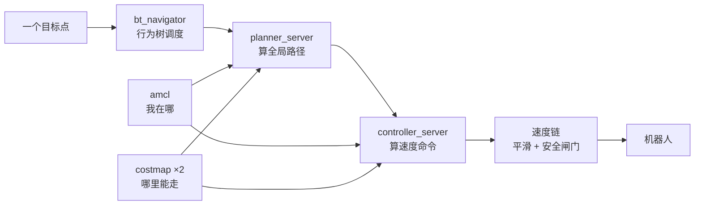

# 详解 · `nav2_params.yaml`

> 这份文档回答三个问题：**每一项什么含义 / 为什么是这个值 / 我怎么调**。
>
> 配套材料（按需查）：
> - [`模块清单.md`](模块清单.md) —— 每个包干什么 / 怎么跑 / 验证到什么程度
> - [`模块解剖.md`](模块解剖.md) —— 每个包里面有什么 / 对外接口
> - [`问题记录.md`](问题记录.md) —— 踩过的坑
> - [`详解-mybot_description.md`](模块详解-mybot_description.md) —— 同一套方法用在描述包上
>
> 文件本体：`src/navigation/mybot_navigation2/config/nav2_params.yaml`（429 行，18 段）

---

## 第零节：怎么读这份文件

### 0.1 先看结构：只有 4 类参数

| 类别 | 数量 | 占比 | 要不要管 |
| --- | ---: | ---: | --- |
| **管线参数**（频率、话题、坐标系） | ~55 | 27% | ⚠️ 改错整体瘫痪 |
| **调优参数**（容差、限速、权重） | ~35 | 17% | ✅ **真正要调的** |
| **Jazzy 适配**（`::`、复数、`enable_stamped_cmd_vel`） | ~15 | 7% | ❌ 别动，动了就坏 |
| **样板 / 用不上**（`map_saver`、`docking`、`waypoint_follower`） | ~95 | 49% | ❌ 跳过 |

**一半参数可以完全不看。** 只有 17% 是「调优」。

> ⚠️ 而且 **「params 里的段」≠「实际运行的节点」**。`route_server` 在 Jazzy 里也会启动，
> 但本文件里**没有它的配置段** —— 和当初 `collision_monitor` / `docking_server` 的情况一样。

### 0.2 每一项只问三个问题

```
1. 含义    : 它影响哪个「观测量」？（不是「它是什么」）
2. 为什么  : 这个值是给「真机」的，还是给「本项目仿真」的？
3. 生效吗  : 什么条件下它才起作用？（模型选项 / 开关 / 有没有被别处覆盖）
```

**第 3 问最关键。** 它能把「配了但不起作用」的参数一眼挑出来 ——
否则你调它不会有任何变化，还会以为调参是玄学。清单见第十二节。

### 0.3 整条管线长什么样



**速度链的三个后置节点**（改参数前必须知道）：

```
controller_server ─┐
                   ├─ cmd_vel_nav ─┐
behavior_server  ──┘               │
                                   ▼
                        velocity_smoother
                                   │
                          cmd_vel_smoothed
                                   │
                                   ▼
                        collision_monitor
                                   │
                              cmd_vel  ← 机器人实际收
docking_server ────────────────────┘（对接时才发）
```

实测端点（`ros2 topic info -v`，严格区分发布/订阅）：

| 话题 | PUBLISHER | SUBSCRIBE |
| --- | --- | --- |
| `/cmd_vel` | `collision_monitor`、`docking_server` | `mybot_diff_drive_controller` |
| `/cmd_vel_nav` | `controller_server`、`behavior_server` | `velocity_smoother` |
| `/cmd_vel_smoothed` | `velocity_smoother` | `collision_monitor` |
| `/odom` | `mybot_diff_drive_controller` | `bt_navigator`、`controller_server` |

> ⚠️ **`/cmd_vel` 有 2 个发布者**（`docking_server` 只在对接时发），
> 和 `问题记录.md` E-12 的 `/clock` 是同一类现象：**「发布者必须为 1」的判据对这两个话题不适用**。

---

## 一、`amcl` — 定位（39 项）

**做什么**：用雷达在地图上做粒子滤波，回答「我在哪」。发 `/amcl_pose` + TF `map → odom`。

### 1.1 坐标系（5 项）— ⚠️ 弄错就完全不动

| 参数 | 值 | 含义 | 为什么 | 怎么调 |
| --- | --- | --- | --- | --- |
| `use_sim_time` | `True` | 用仿真时钟 | gz 在发 `/clock` | 真机才 `False` |
| `global_frame_id` | `map` | 位姿输出坐标系 | 地图坐标系 | 别动 |
| `odom_frame_id` | `odom` | 里程计坐标系 | 与控制器一致 | 别动 |
| `base_frame_id` | `base_footprint` | 机器人本体帧 | ⚠️ **不是 `base_link`** | 必须与 `mybot_ros2_controller.yaml` 一致，否则 TF 断链 |
| `tf_broadcast` | `true` | 是否发 `map→odom` | 关掉全系统瘫 | 见下方「陷阱」 |

> ⚠️ **陷阱**：`tf_broadcast: false` 不只是少了条 TF。它会导致
> `global_costmap` 等不到 `base_link → map`，**`planner_server` 激活失败，整个 Nav2 bringup 中止**。
> 详见第十三节场景 B。

### 1.2 运动模型（7 项）

| 参数 | 值 | 含义 |
| --- | ---: | --- |
| `robot_model_type` | `DifferentialMotionModel` | 差速模型 |
| `alpha1` | 0.2 | **旋转**引起的**旋转**噪声 |
| `alpha2` | 0.2 | **平移**引起的**旋转**噪声 |
| `alpha3` | 0.2 | **平移**引起的**平移**噪声 |
| `alpha4` | 0.2 | **旋转**引起的**平移**噪声 |
| `alpha5` | 0.2 | 平移→平移（**仅全向模型用**） |

**含义**：这是「**odom 有多不可信**」的四个维度。取 0 = 完全相信里程计（粒子不扩散）；取大 = 不相信。

**为什么是 0.2**：教材值，为**真机**准备（真机轮子打滑）。对本项目仿真偏保守。

**怎么调**：

| 现象 | 调法 |
| --- | --- |
| 粒子云散得很开、位姿乱跳 | 调**小**（0.05） |
| 机器人「瞬移」、跟不上 | 调**大** |

> ⚠️ 本项目 `odom` 是 `open_loop: true`（直接积分**指令速度**），漂移是**系统性**的
> （见 `问题记录.md` E-5：巡逻一圈漂 7 m / 38°）。
> **调 alpha 不能解决漂移** —— alpha 只控制粒子扩散速度，不修正「odom 本身就错」。

### 1.3 粒子规模（7 项）

| 参数 | 值 | 含义 | 怎么调 |
| --- | ---: | --- | --- |
| `min_particles` | 500 | 粒子数下限 | 太小 → 定位卡死 |
| `max_particles` | 2000 | 上限 | 太大 → 拖 CPU |
| `pf_err` | 0.05 | KLD 采样目标误差 | 调小 → 更准更慢 |
| `pf_z` | 0.99 | 上项置信度 | 一般不动 |
| `resample_interval` | 1 | 每 N 次更新重采样一次 | 调大省 CPU、收敛变慢 |
| `recovery_alpha_slow` | **0.0** | 「被绑架」检测（慢） | 0 = **关闭** |
| `recovery_alpha_fast` | **0.0** | 「被绑架」检测（快） | 0 = **关闭** |

**为什么 recovery 关掉**：这是「有人把机器人抱走」的检测机制。**仿真里不可能发生**，
关掉省 CPU，还避免误触发导致定位乱跳。真机搬迁场景才开。

### 1.4 激光观测模型（8 项）

| 参数 | 值 | 含义 | 生效条件 |
| --- | ---: | --- | --- |
| `laser_model_type` | `likelihood_field` | 似然场模型（快、对跳变不敏感） | — |
| `z_hit` | 0.5 | 读数来自**真实障碍**的权重 | ✅ |
| `z_rand` | 0.5 | 读数来自**随机噪声**的权重 | ✅ |
| `z_max` | 0.05 | 读数 = **最大量程**的权重 | ✅ |
| `z_short` | 0.05 | 被**近处障碍截断**的权重 | ⚠️ 仅 `beam` 模型（**待验证**） |
| `lambda_short` | 0.1 | 上项的指数衰减率 | ⚠️ 仅 `beam` 模型（**待验证**） |
| `sigma_hit` | 0.2 | 命中高斯的标准差（米） | ✅ |
| `laser_likelihood_max_dist` | 2.0 | 似然场影响半径（米） | ✅ |

#### 看起来可疑，但实测证明**不该改**

`z_hit + z_rand + z_max + z_short ≈ 1`，现在是 $0.5+0.5+0.05+0.05 = 1.1$。

**`z_hit = 0.5` 意味着模型认为「一半的雷达读数都是随机的」**，而本项目雷达是
`gpu_lidar` + `gaussian stddev=0.01`，非常干净。教材的 0.5/0.5 是给真机的。

**实测 A/B（固定开环轨迹，19 个采样点）**：

| | `z_hit=0.5 / z_rand=0.5`（基线） | `z_hit=0.9 / z_rand=0.05`（改后） |
| --- | ---: | ---: |
| 偏差均值 | 0.207 m | 0.216 m |
| 偏差中位数 | 0.200 m | 0.199 m |
| 偏差最大 | 0.370 m | 0.407 m |
| 末段平均 | 0.156 m | 0.158 m |

**结论：差异落在噪声内，没有可测改进。不建议改。**

> 为什么没差别：仿真的雷达和地图是**同一套几何**生成的，模型怎么设都差不多；
> 真机（玻璃反射、动态障碍、地图失配）才体现差异。
>
> ⚠️ 注意这个指标本身有局限：它测的是「AMCL 位姿 vs gz 真值」，
> 包含了**地图自身的几何误差**（地图是 SLAM 建的，与 world 不完全一致）。
> 所以绝对值不等于「AMCL 误差」，**只有两次运行的差值**才有意义。

### 1.5 跳束（4 项）— **3 项配了不生效**

| 参数 | 值 | 含义 | 生效条件 |
| --- | ---: | --- | --- |
| `do_beamskip` | **`false`** | 是否开启跳束（忽略对不上的束） | — |
| `beam_skip_distance` | 0.5 | ⚠️ **不生效** | 需 `do_beamskip: true` |
| `beam_skip_threshold` | 0.3 | ⚠️ **不生效** | 同上 |
| `beam_skip_error_threshold` | 0.9 | ⚠️ **不生效** | 同上 |

**为什么关**：仿真里没有动态障碍（不会有人突然站在雷达前）。

### 1.6 性能与更新节奏（8 项）

| 参数 | 值 | 含义 | 怎么调 |
| --- | ---: | --- | --- |
| `max_beams` | 60 | 每次只用 **60 束**算权重（雷达有 360 束） | 调大 → 更准更慢 |
| `laser_max_range` | 100.0 | 超过此距离的读数忽略 | 雷达实际只有 **8 m**，可调 `8.0` 更贴合 |
| `laser_min_range` | -1.0 | **-1 = 用雷达自带 min range** | 保持 -1 |
| `scan_topic` | `scan` | 订阅的雷达话题（相对名 → `/scan`） | — |
| `update_min_d` | 0.25 | 移动 **0.25 m** 才做一次更新 | 调小 → 跟手、耗 CPU |
| `update_min_a` | 0.2 | 转 **0.2 rad** 才更新 | 同上 |
| `transform_tolerance` | 1.0 | TF 时间戳容忍（秒） | ⚠️ **1.0 很宽松**（默认 0.1），`map→odom` 时间戳会偏旧 |
| `save_pose_rate` | 0.5 | 每 2 秒把位姿写进参数服务器 | 本项目用不上 |

> 💡 **`update_min_d` / `update_min_a` 有个副作用你会遇到**：
> 机器人**静止时 `/amcl_pose` 完全不发**（不满足更新条件）。
> 调试时以为话题挂了，其实正常。见第十三节场景 C。

---

## 二、`bt_navigator` — 行为树调度（8 项）

| 参数 | 值 | 含义 | 怎么调 |
| --- | --- | --- | --- |
| `global_frame` | `map` | 全局坐标系 | 别动 |
| `robot_base_frame` | `base_link` | 机器人本体帧 | ⚠️ 与 AMCL 的 `base_footprint` **不同**，这是**故意的** |
| `odom_topic` | `/odom` | 里程计话题 | 别动 |
| `bt_loop_duration` | 10 | 行为树 tick 周期（ms） | 调大省 CPU、反应变慢 |
| `default_server_timeout` | 20 | 等动作服务器超时（ms） | 别动 |
| `plugin_lib_names` | **整行注释掉** | 内置 BT 节点列表 | ⚠️ **必须保持注释**，见第十一节第 1 条 |

---

## 三、`controller_server` — 速度控制器（17 项 + DWB 40 项）

输出 `/cmd_vel_nav`。

### 3.1 服务器级（9 项）

| 参数 | 值 | 含义 | 为什么 | 怎么调 |
| --- | --- | --- | --- | --- |
| `enable_stamped_cmd_vel` | `True` | 发 `TwistStamped` 而非 `Twist` | ⚠️ Jazzy 适配 | 关掉车不动 |
| `controller_frequency` | 20.0 | 控制循环频率（Hz） | 常规值 | 调大更平滑、耗 CPU |
| `min_x_velocity_threshold` | 0.001 | 低于此线速度视为 0 | 防抖 | 别动 |
| `min_y_velocity_threshold` | 0.5 | 同上（横向） | 差速车无横向 | 别动 |
| `min_theta_velocity_threshold` | 0.001 | 同上（角速度） | 防抖 | 别动 |
| `failure_tolerance` | 0.3 | 控制失败容忍（秒） | 常规值 | 调大更宽容 |
| `progress_checker_plugins` | `["progress_checker"]` | ⚠️ **复数** | Jazzy 适配 | 写成单数会漏加载 |
| `goal_checker_plugins` | `["general_goal_checker"]` | ⚠️ **复数** | 同上 | 同上 |
| `controller_plugins` | `["FollowPath"]` | 用哪个控制器 | 名字要与下面的键对应 | 换插件时改这里 + 下面的 `plugin` |

### 3.2 进度检查器（3 项）— 「卡住」的判定者

| 参数 | 值 | 含义 | 怎么调 |
| --- | ---: | --- | --- |
| `plugin` | `SimpleProgressChecker` | 简单版 | — |
| `required_movement_radius` | 0.5 | **10 秒内必须移动 0.5 m** | ⚠️ 太严 → 慢速过窄门时**被误判卡住** |
| `movement_time_allowance` | 10.0 | 上面那个「10 秒」 | 调大 → 更宽容 |

> 💡 这两个是「`Failed to make progress`」的**直接来源**（见 `问题记录.md` E-1）。

### 3.3 目标检查器（4 项）— 「到了」的判定者

| 参数 | 值 | 含义 | 怎么调 |
| --- | ---: | --- | --- |
| `plugin` | `SimpleGoalChecker` | 简单版 | — |
| `xy_goal_tolerance` | 0.25 | 距目标 **25 cm** 内算到 | ⚠️ **直接决定「到位误差」**。项目实测 0.16~0.38 m，与它同量级 |
| `yaw_goal_tolerance` | 0.25 | 朝向误差 **0.25 rad**（14°）内算到 | 同上 |
| `stateful` | `True` | 到过一次就算到 | 关了会在目标附近抖动 |

### 3.4 DWB（40 项）— 车「走得好不好」全在这

DWB = 在**速度空间里撒采样点**，用一串「评分器」打分，选最高分的。

#### 速度与加速度限制（8 项）

| 参数 | 值 | 含义 | 怎么调 |
| --- | ---: | --- | --- |
| `min_vel_x` | 0.0 | 最小前进速度 | 设为负值可倒车 |
| `min_vel_y` / `max_vel_y` | 0.0 | 横移 | 差速车恒 0 |
| `max_vel_x` | **0.26** | **最大前进速度** | ⚠️ 最常调。但**还有别处限速**，见第十四节 |
| `max_vel_theta` | 1.0 | 最大角速度（rad/s） | 调大转得快、易晃 |
| `min_speed_xy` / `min_speed_theta` | 0.0 | 最小速度 | 防抖 |
| `max_speed_xy` | 0.26 | 合速度上限 | — |

#### 加减速（6 项）

| 参数 | 值 | 含义 | 怎么调 |
| --- | ---: | --- | --- |
| `acc_lim_x` / `decel_lim_x` | 2.5 / -2.5 | 线加/减速度上限 | 调小 → 起步更柔、更慢 |
| `acc_lim_theta` / `decel_lim_theta` | 3.2 / -3.2 | 角加/减速度上限 | 调小 → 转向更柔 |
| `acc_lim_y` / `decel_lim_y` | 0.0 | 横移 | 差速车恒 0 |

#### 采样与预测（9 项）

| 参数 | 值 | 含义 | 怎么调 |
| --- | ---: | --- | --- |
| `vx_samples` | 20 | 线速度采样数 | 三者共同决定计算量（$20×5×20=2000$ 条轨迹）。调大更准更慢 |
| `vy_samples` | 5 | 横移采样数 | 差速车可减到 1 |
| `vtheta_samples` | 20 | 角速度采样数 | — |
| `sim_time` | 1.7 | 每条轨迹往前推演 1.7 秒 | 调小 → 反应快但易撞；调大 → 保守 |
| `linear_granularity` / `angular_granularity` | 0.05 / 0.025 | 轨迹点间距 | 别动 |
| `transform_tolerance` | 0.2 | TF 容忍 | 别动 |
| `trans_stopped_velocity` | 0.25 | 判定「停住」的速度阈值 | 别动 |
| `short_circuit_trajectory_evaluation` | `True` | 遇到更差轨迹提前放弃评分 | 提速用 |
| `xy_goal_tolerance` / `stateful` | 0.25 / `True` | 与 goal_checker 呼应 | — |

#### 7 个 critics（评分器）— 最值得理解

```yaml
critics: ["RotateToGoal", "Oscillation", "BaseObstacle", "GoalAlign",
          "PathAlign", "PathDist", "GoalDist"]
```

| Critic | 管什么 | 出问题的症状 |
| --- | --- | --- |
| `BaseObstacle` | 撞不撞障碍 | 撞墙 |
| `PathAlign` / `PathDist` | 跟不跟全局路径 | 偏离路径 |
| `GoalAlign` / `GoalDist` | 朝不朝目标 | 绕圈 |
| `Oscillation` | 左摇右摆 | 原地抖动 |
| `RotateToGoal` | 终点前先转正 | 到不了目标朝向 |

**它们的 `.scale` 权重才是调参核心**：

| 参数 | 值 | 调它会发生什么 |
| --- | ---: | --- |
| `BaseObstacle.scale` | **0.02** | ⚠️ **极低**。调大 → 更躲障碍、但可能不敢走窄路 |
| `PathAlign.scale` | 32.0 | 调大 → 更贴路径 |
| `PathDist.scale` | 32.0 | 同上 |
| `GoalAlign.scale` | 24.0 | 调大 → 更朝目标 |
| `GoalDist.scale` | 24.0 | 同上 |
| `RotateToGoal.scale` | 32.0 | 调大 → 终点转向更积极 |
| `RotateToGoal.slowing_factor` / `lookahead_time` | 5.0 / -1.0 | 终点减速曲线 |
| `PathAlign.forward_point_distance` / `GoalAlign.*` | 0.1 | 前视距离 |

> 💡 **`BaseObstacle.scale = 0.02` 比其他的低 3 个数量级**，等于说「跟路径」远比「躲障碍」重要。
> 本项目还能跑通，是因为**代价地图的膨胀层已经提前把障碍推远了** ——
> 避障主要靠 costmap，不靠 DWB。

**按症状查表（不要按参数查）**：

| 症状 | 该动的 scale |
| --- | --- |
| 撞墙 / 蹭墙 | `BaseObstacle.scale` ⬆️ |
| 偏离全局路径 | `PathAlign.scale` / `PathDist.scale` ⬆️ |
| 靠近目标时绕圈 | `GoalDist.scale` / `GoalAlign.scale` ⬆️ |
| 原地左右抖 | `Oscillation` 相关（或降 `vtheta_samples`） |
| 到不了目标朝向 | `RotateToGoal.scale` ⬆️ |

---

## 四、`local_costmap` — 局部代价地图（30 项）

以机器人为中心、3×3 m 的滚动窗口，标记**实时障碍**。给 DWB 用。

| 参数 | 值 | 含义 | 为什么 | 怎么调 |
| --- | --- | --- | --- | --- |
| `update_frequency` | 5.0 | 重算频率（Hz） | 与雷达 10 Hz 匹配 | 调大更实时、耗 CPU |
| `publish_frequency` | 2.0 | 发布频率（Hz） | rviz 显示用 | — |
| `global_frame` | **`odom`** | 基准坐标系 | ⚠️ **关键**：用 `odom` 不用 `map`。`odom` 连续不跳变；用 `map` 会在 AMCL 修正时整张图跳 | 别改 |
| `robot_base_frame` | `base_link` | 机器人帧 | — | — |
| `rolling_window` | `true` | 地图跟着车走 | 局部地图的**核心机制** | 关掉就变固定地图 |
| `width` / `height` | 3 / 3 | 窗口尺寸（米） | 车 0.26 m/s × `sim_time` 1.7 s ≈ 0.44 m，3 m 够 | 调大 → 看得远、耗内存 |
| `resolution` | 0.05 | 分辨率（米/格） | 与全局地图一致 | 别动 |
| `robot_radius` | **0.22** | 机器人半径（米） | 与 `inflation_radius` 耦合 | 见下 |
| `always_send_full_costmap` | `True` | 每周期发完整地图 | 调试方便、带宽大 | 生产可关 |

### 4.1 「能不能过门」的决定性组合

| 参数 | 值 | 含义 | 怎么调 |
| --- | ---: | --- | --- |
| `inflation_radius` | 0.55 | 障碍物影响半径（米） | **调大 → 更保守、可能过不了窄门**；调小 → 敢走但易蹭 |
| `cost_scaling_factor` | 3.0 | 代价衰减速率 | 调**大** → 衰减快（敢贴墙）；调**小** → 离墙老远就绕 |

**⚠️ 这两个旋钮管的不是同一件事，别混：**

- **能不能过** —— 由**内切半径**（圆车 = `robot_radius`）决定，是**硬阻断**：
  车中心一旦落入 `cost = 253` 的格子，规划器和控制器都认为那里不可走。
  所以通道要能过，**净宽必须 > 2 × 内切半径**。
- **愿不愿意贴边走** —— 由 `inflation_radius` / `cost_scaling_factor` 决定，是**软代价**：
  超过内切半径之后按 `252 · exp(-csf · (d − r))` 衰减，只是让规划器**倾向**走中间。

> 🔬 **实测（2026-10-03）**：用 `tools/probe_costmap.py` 从代价地图**反推**实际生效的内切半径 ——
> `global_costmap` **0.2249 m**、`local_costmap` **0.2248 m**，
> 而配置里 `robot_radius` 写的是 **0.22**（已在运行节点上 `ros2 param get` 复核），
> **差 +4.9 mm**，且在 8 个独立距离桶上稳定。**原因未定位**（见 `问题记录.md` E-15）。
> 换算成「通道净宽要求」就是 `2 × 0.2249 = 0.4498 m`，而不是 `2 × 0.22 = 0.44 m`。

> 💡 这是「导航能过但撞墙」和「导航保守到走不动」之间的旋钮。
> **改完必须用 `tools/map_reachability.py` 确认目标仍可达** —— 别只看「导航成不成功」。

### 4.2 层插件

| 层 | plugin | 作用 | 注意 |
| --- | --- | --- | --- |
| `voxel_layer` | `VoxelLayer` | **3D** 体素化障碍 | 比 `obstacle_layer` 多高度维度 |
| `inflation_layer` | `InflationLayer` | 把障碍「撑大」，制造安全边际 | — |
| `static_layer` | `StaticLayer` | 定义了但**没放进 `plugins` 列表** | ⚠️ **不生效**，见下 |

> 🔬 **实测证据（2026-10-03）**：两条代价地图的致命格（`cost = 254`）数量：
> `global_costmap` **3475 个**（≈ `room.pgm` 里的 3463 个障碍格，对得上）；
> `local_costmap` 只有 **34 个** —— 就是 3×3 m 窗口内雷达当场看到的那点东西。
> 若 `local_costmap` 的 `static_layer` 生效了，这个数字应该接近 `global` 的量级。
> 测法：`tools/probe_costmap.py --topic /<ns>/costmap_raw`。

### 4.3 观测源 `scan`（8 项）

| 参数 | 值 | 含义 | 怎么调 |
| --- | ---: | --- | --- |
| `topic` | `/scan` | 雷达话题 | — |
| `max_obstacle_height` | 2.0 | 忽略高于 2 m 的点 | — |
| `clearing` | `True` | 能否清除障碍（射线打通处标为自由） | ⚠️ 关掉 → 障碍**永不消失**（残影） |
| `marking` | `True` | 能否标记障碍 | 关掉 → 什么都不标 |
| `data_type` | `LaserScan` | 消息类型 | — |
| `raytrace_max_range` | 3.0 | **清除**射线最大距离 | ⚠️ 应 ≥ `obstacle_max_range` |
| `raytrace_min_range` | 0.0 | 清除射线最小距离 | 别动 |
| `obstacle_max_range` | 2.5 | **标记**障碍最大距离 | 调大 → 更远的障碍也标 |
| `obstacle_min_range` | 0.0 | 标记最小距离 | 别动 |

> 💡 `raytrace_max_range` (3.0) > `obstacle_max_range` (2.5) 是**正确**的。
> 反过来会出现「标了却清不掉」的**幽灵障碍**。

---

## 五、`global_costmap` — 全局代价地图（28 项）

含**静态地图 + 障碍 + 膨胀**。给全局规划器用。

**与 local 的关键差异**：

| 参数 | local | global | 为什么不同 |
| --- | --- | --- | --- |
| `global_frame` | `odom` | **`map`** | 全局必须用地图坐标系 |
| `rolling_window` / `width` / `height` | `true` / 3 / 3 | 无 | 全局是固定整图 |
| `update_frequency` | 5.0 | **1.0** | 全局地图变得慢 |
| `publish_frequency` | 2.0 | 1.0 | 同上 |
| `track_unknown_space` | 无 | **`true`** | 见下 |
| `plugins` | `voxel_layer` + `inflation_layer` | **`static_layer` + `obstacle_layer` + `inflation_layer`** | 全局用 2D 的 `obstacle_layer`（更省） |
| `static_layer` 在 `plugins` 里 | ❌ | ✅ | local 是滚动窗口，没有静态地图概念 |

### `track_unknown_space: true`

| 值 | 效果 |
| --- | --- |
| `true`（当前） | 地图外的未知区域**标记为未知**，规划器避免进入 |
| `false` | 未知区域当作**自由空间**，规划器敢往里走 |

> 💡 如果发现「规划器死活不往某片区域走」，先看那儿在地图里是不是「未知灰色」。

---

## 六、`planner_server` — 全局规划（5 项）

| 参数 | 值 | 含义 | 怎么调 |
| --- | ---: | --- | --- |
| `expected_planner_frequency` | 20.0 | 期望规划频率 | 慢过这个会告警 |
| `planner_plugins` | `["GridBased"]` | 用哪个规划器 | 名字要和下面键一致 |
| `GridBased.plugin` | `nav2_navfn_planner::NavfnPlanner` | ⚠️ **用 `::` 不是 `/`** | Jazzy 适配 |
| `GridBased.tolerance` | 0.5 | 目标点在障碍里时，允许多远内找替代 | 调大 → 目标在墙上也能规划 |
| `GridBased.use_astar` | `false` | `false` = Dijkstra，`true` = A* | 🔬 **实测：对路径几乎没影响**（差 0.5%），见下 |
| `GridBased.allow_unknown` | `true` | 允许穿越未知区域 | 与 `track_unknown_space` 配合 |

> 🔬 **实测（2026-10-03）：navfn 最小化的是「代价」不是「距离」**
>
> 起终点 `(2.17, 1.88) → (-4.50, 1.50)`（直线 6.68 m），用 `tools/probe_planner.py` 量：
>
> | 路线 | 长度 | 代价积分 `∫(50+0.8·cost)ds` | 沿途最高导航代价 |
> | --- | ---: | ---: | ---: |
> | 直线 | 6.68 m | —（不可行） | **253.0**（`x≈-2.12` 处离墙只有 0.05 m） |
> | **只按距离找路**（对照组） | **17.60 m** | **3383.0** | **253.0**（不惜贴墙） |
> | **navfn 实际输出** | **18.50 m** | **924.9** | **50.0**（全程纯开阔地） |
>
> navfn 多绕 **0.9 m**，代价降 **2458（−72.7%）** → **代价驱动**。
> 决定性旁证：navfn 输出的沿途最高导航代价 **= 50.0 = `COST_NEUTRAL`**，
> 它全程只走 `costmap cost = 0` 的格子。
>
> **`use_astar` 的 A/B（同一对起终点，只改这一个参数）**：
>
> | | 路径点数 | 长度 | 代价积分 |
> | --- | ---: | ---: | ---: |
> | `false`（Dijkstra） | 735 | 18.40 m | 920.0 |
> | `true`（A*） | 739 | **18.50 m** | **924.9** |
>
> **差 0.5%，基本是同一条路**（而且 A* 略长）。原因：navfn 的 A* 启发式是**可采纳**的
> （所有格子的导航代价都 ≥ `COST_NEUTRAL`），两者最小化的是同一个代价函数 → 最优解相同；
> `use_astar` 影响的是**搜索开销**（扩展多少格子），不是路径形状。
>
> ⚠️ 所以：**「想让它走直路就换 A*」是错的**（本仓库原来在 `README.md`、
> `问题记录.md` E-4、`tools/map_clearance.py` 三处都这么写过，已一并纠正）。
> 真正的旋钮是 `inflation_radius` / `cost_scaling_factor`，而前提是**那条缝真的过得去**。

---

## 七、`behavior_server` — 恢复行为（16 项）

卡住时执行「转一圈 / 后退 / 等待」等脱困动作。

| 参数 | 值 | 含义 | 怎么调 |
| --- | --- | --- | --- |
| `costmap_topic` | `local_costmap/costmap_raw` | 读哪张图 | — |
| `footprint_topic` | `local_costmap/published_footprint` | 机器人足迹 | — |
| `cycle_frequency` | 10.0 | 行为循环频率 | — |
| `behavior_plugins` | 5 个名字 | 启用的行为列表 | 删掉某个就不再有那个恢复手段 |
| `spin.plugin` | `nav2_behaviors::Spin` | ⚠️ `::` 适配 | Humble 用 `/` |
| `backup.plugin` | `nav2_behaviors::BackUp` | ⚠️ 同上 | |
| `drive_on_heading.plugin` | `nav2_behaviors::DriveOnHeading` | ⚠️ 同上 | |
| `wait.plugin` | `nav2_behaviors::Wait` | ⚠️ 同上 | |
| `assisted_teleop.plugin` | `nav2_behaviors::AssistedTeleop` | ⚠️ 同上 | |
| `global_frame` | `odom` | 用 `odom`（不跳变） | 别改 |
| `robot_base_frame` | `base_link` | — | — |
| `transform_tolerance` | 0.1 | TF 容忍 | — |
| `enable_stamped_cmd_vel` | **`True`** | ⚠️ Jazzy 适配 | 见下 |
| `simulate_ahead_time` | 2.0 | 提前模拟 2 秒防撞 | — |
| `max_rotational_vel` / `min_rotational_vel` | 1.0 / 0.4 | 脱困转向速度 | — |
| `rotational_acc_lim` | 3.2 | 角加速度 | — |

> 💡 **`enable_stamped_cmd_vel: True` 在这里尤其关键**：
> 恢复动作也走 `/cmd_vel`。**不开的话，机器人卡住以后就永远脱不了困** ——
> 因为恢复指令本身被类型不匹配丢掉了。

---

## 八、`velocity_smoother` — 速度平滑（14 项）

把控制器输出的突变速度**平滑成连续变化**，保护电机、减少打滑。

| 参数 | 值 | 含义 | 怎么调 |
| --- | --- | --- | --- |
| `enable_stamped_cmd_vel` | `True` | ⚠️ Jazzy 适配 | — |
| `smoothing_frequency` | 20.0 | 平滑频率 | — |
| `scale_velocities` | `False` | 是否按加速度上限**缩放**速度 | `true` 会主动降速 |
| `feedback` | `OPEN_LOOP` | 开环（不看实际速度） | — |
| `max_velocity` | `[0.26, 0.0, 1.0]` | ⚠️ **[线速度, 横移, 角速度] 上限** | **这是第二处限速**，见第十四节 |
| `min_velocity` | `[-0.26, 0.0, -1.0]` | 下限 | — |
| `max_accel` / `max_decel` | `[2.5, 0, 3.2]` / `[-2.5, 0, -3.2]` | 加/减速度上限 | 调小 → 更柔 |
| `odom_topic` / `odom_duration` | `odom` / 0.1 | 里程计来源与窗口 | — |
| `deadband_velocity` | `[0, 0, 0]` | 死区（小于它直接归零） | 调大可消除微小抖动 |
| `velocity_timeout` | 1.0 | 超时归零（秒） | — |

---

## 九、`collision_monitor` — 安全闸门（18 项）

**独立于规划层**的最后一道闸门，直接看传感器决定「能不能走」。

| 参数 | 值 | 含义 | 怎么调 |
| --- | --- | --- | --- |
| `base_frame_id` / `odom_frame_id` | `base_footprint` / `odom` | 与 AMCL 一致 | — |
| `cmd_vel_in_topic` | `cmd_vel_smoothed` | 从哪收 | 速度链位置 |
| `cmd_vel_out_topic` | **`cmd_vel`** | ⚠️ **它是 `/cmd_vel` 的发布者** | 改这个会断链 |
| `state_topic` | `collision_monitor_state` | 当前状态 | **调试时订阅它** |
| `enable_stamped_cmd_vel` | `True` | ⚠️ Jazzy 适配 | — |
| `transform_tolerance` | 0.2 | TF 容忍 | — |
| `source_timeout` | 1.0 | 传感器超时（秒） | — |
| `base_shift_correction` | `True` | 修正车体旋转导致的足迹偏移 | — |
| `stop_pub_timeout` | 2.0 | 停车后多久停发零速 | — |
| `polygons` | `["FootprintApproach"]` | 检测区域 | — |
| `FootprintApproach.type` | `polygon` | 用足迹多边形 | — |
| `FootprintApproach.action_type` | **`approach`** | ⚠️ **遇障减速**（不是急停） | 改成 `stop` 会一有障碍就急停 |
| `FootprintApproach.time_before_collision` | 1.2 | 预测 1.2 秒后是否会撞 | — |
| `FootprintApproach.min_points` | 6 | 至少几个点才认作障碍 | 调大可过滤噪声 |
| `FootprintApproach.visualize` | `False` | 是否发布可视化 | rviz 调试时开 |
| `observation_sources` | `["scan"]` | 用哪些传感器 | — |
| `scan.type` / `topic` | `scan` / `scan` | — | — |
| `scan.min_height` / `max_height` | 0.15 / 2.0 | 只看这个高度区间 | ⚠️ 调高 `min_height` 会**看不见地面障碍** |

---

## 十、其余段（基本都是样板）

| 段 | 参数 | 值 | 含义 | 注意 |
| --- | --- | --- | --- | --- |
| `map_server` | `yaml_filename` | `""` | 空 = 由 launch 传 `map:=` | 别在这里写死 |
| `map_saver` | `save_map_timeout` / `free_thresh_default` / `occupied_thresh_default` / `map_subscribe_transient_local` | 5.0 / 0.25 / 0.65 / true | 存地图用 | 本项目不用 |
| `smoother_server` | `plugin` / `tolerance` / `max_its` / `do_refinement` | `SimpleSmoother` / 1e-10 / 1000 / true | 把折线路径磨平滑 | 默认不开也行 |
| `waypoint_follower` | `loop_rate` / `stop_on_failure` / `waypoint_task_executor_plugin` / `wait_at_waypoint` | 20 / false / `wait_at_waypoint` / … | 多点巡逻 | ⚠️ **本项目的巡逻没用它**（用 `autopatrol_robot` 自己写的循环） |
| `robot_state_publisher` | `use_sim_time` | `True` | 只是同步时钟 | — |
| `docking_server` | `enable_stamped_cmd_vel` / `dock_plugins` / `simple_charging_dock.*` | `True` / … | ⚠️ Jazzy 新节点，项目不用它但**必须配** | 见第十一节第 8 条 |
| `bt_navigator_navigate_*_rclcpp_node` | `use_sim_time` | `True` | 只是同步时钟 | — |

---

## 十一、8 处 Jazzy 适配（「为什么这样配」的答案）

| # | 位置 | 改动 | 不改的后果 |
| ---: | --- | --- | --- |
| 1 | `bt_navigator` | `plugin_lib_names` **整行注释** | 重复注册 → **container 段错误**，lifecycle 全卡 |
| 2 | `controller_server` | `progress_checker_plugins` **复数** | 加载不到进度检查器 |
| 3 | `controller_server` | `goal_checker_plugins` **复数** | 同上 |
| 4 | `planner_server` | `nav2_navfn_planner::NavfnPlanner`（`::`） | 启动即 FATAL：`class ... does not exist` |
| 5 | `behavior_server` | `nav2_behaviors::Xxx`（5 处 `::`） | 同上 |
| 6 | 5 处 | `enable_stamped_cmd_vel: True` | `/cmd_vel` 类型不匹配 → **车不动 / 卡住脱不了困** |
| 7 | 新增 | `collision_monitor` 整段 | lifecycle 配置失败：`parameter 'observation_sources' is not initialized` |
| 8 | 新增 | `docking_server` 整段 | bringup 直接 abort，见下 |

### 第 1 条为什么这么危险

原书把内置 BT 节点**逐个列出来**。Jazzy 里它们是**自动注册**的，再列一遍会重复注册：

```
bt_navigator: Failed to create navigator id navigate_to_pose.
Exception: ID [ComputePathToPose] already registered
```

后果：**整个 component_container 段错误退出，lifecycle 全体卡住**。

**而且不能写成 `plugin_lib_names: []`** —— launch 归一化参数时会把空列表变成空元组并抛异常：

```
Expected 'value' to be one of [float, int, str, bool, bytes], but got '()'
```

**必须整行注释掉。** 官方默认文件也是这么做的。

### 第 8 条为什么必须配

即使项目**不做自动充电坞对接**，不配它会这样死：

```
could not create publisher: create_publisher() called for existing topic name
rt/cmd_vel with incompatible type geometry_msgs::msg::dds_::Twist_
-> Lifecycle node docking_server does not have error state implemented
-> Failed to bring up all requested nodes. Aborting bringup.
```

原因：它在激活时会建 `/cmd_vel` 发布者，**默认类型是 `Twist`**，
与已经声明为 `TwistStamped` 的 `/cmd_vel` **类型冲突**。加 `enable_stamped_cmd_vel: True` 才行。

---

## 十二、调优优先级：真正值得动的只有十几个

### 第一梯队：改了立刻能看见效果（7 个）

| # | 参数 | 值 | 改它会怎样 | 怎么验证 |
| ---: | --- | ---: | --- | --- |
| 1 | `{local,global}_costmap.inflation_radius` | 0.55 | ⬆️ 更怕撞、可能**过不了窄门**<br>⬇️ 敢走、易蹭墙 | `tools/map_reachability.py` |
| 2 | `cost_scaling_factor` | 3.0 | ⬆️ 敢贴墙<br>⬇️ 离墙老远就绕 | 同上 |
| 3 | `FollowPath.max_vel_x` | 0.26 | 直接决定车速 | 见第十四节（三处限速） |
| 4 | `general_goal_checker.xy_goal_tolerance` | 0.25 | 直接决定**到位误差** | `tools/probe-localization-vs-truth.sh` |
| 5 | `progress_checker.required_movement_radius`<br>`movement_time_allowance` | 0.5 / 10.0 | 太严 → 慢速过窄门**被误判卡住** | `tools/run-stuck-repro.sh` |
| 6 | `amcl.update_min_d` / `update_min_a` | 0.25 / 0.2 | ⬇️ 定位更跟手、耗 CPU | 看 CPU + 粒子云 |
| 7 | `FollowPath.sim_time` | 1.7 | ⬆️ 更保守平滑<br>⬇️ 反应快但易撞 | 看轨迹是否抖 |

> 💡 这 7 个的共同点：改完**几秒内**就能从话题/图上看到区别。**这才是好的调参起点。**

### 第二梯队：需要理解才能改（5 个）

| 参数 | 什么时候才动 |
| --- | --- |
| `amcl.alpha1~4` | 真机打滑明显时（仿真里治不了 `open_loop` 漂移） |
| `FollowPath.critics[].scale` | 出现**特定**症状时（按第七节 3.4 的症状表查） |
| `amcl.z_hit` / `z_rand` | 真机 / 有动态障碍时（仿真里改了测不出差别） |
| `amcl.max_beams` | CPU 吃紧或精度不够时 |
| `robot_radius` | 换机器人时（与 `inflation_radius` 耦合，单独改没意义） |

### 第三梯队：绝对不要动

| 参数 | 改了会 |
| --- | --- |
| 11 处 `enable_stamped_cmd_vel` | `/cmd_vel` 类型冲突 → **车不动** / 卡住脱不了困 |
| `bt_navigator.plugin_lib_names` | **必须保持注释** → 取消注释则 container 段错误 |
| 所有 `nav2_xxx::YYY` 的 `::` | 换成 `/` → 启动即 FATAL |
| `*_plugins`（复数） | 改成单数 → 插件加载不到 |
| `amcl.tf_broadcast` | 关掉 → 没有 `map→odom` → **planner_server 激活失败** |
| `local_costmap.global_frame` | `odom` 改成 `map` → AMCL 每次修正时局部地图整张跳变 |

---

## 十三、怎么调试

### 13.1 场景 A：车不动

**从速度链末端往回查**（不要从头查）：

```bash
ros2 topic info /cmd_vel -v     # 期望发布者是 collision_monitor
ros2 topic hz /cmd_vel          # 有频率吗？
ros2 topic hz /cmd_vel_smoothed
ros2 topic hz /cmd_vel_nav
ros2 node info /controller_server | head -30
```

| 现象 | 原因 |
| --- | --- |
| `/cmd_vel` 有数据但车不动 | 类型不对（发了 `Twist`，控制器要 `TwistStamped`）→ 查 `enable_stamped_cmd_vel` |
| `/cmd_vel` 完全没数据 | `collision_monitor` 或 `velocity_smoother` 没激活 |
| `/cmd_vel` 频率 **< 2 Hz** | 低于 `cmd_vel_timeout: 0.5s`，控制器把它当**过期指令**丢掉 |

> 💡 第三条是个隐蔽的坑：**自己写节点下发速度时，发布频率必须 > 2 Hz**。
> 实测在采样循环里顺带发布（每次采样要调 `gz model` 子进程 ≈ 300 ms），
> 频率掉到 ~1.8 Hz，机器人**走走停停**（应走 3 m 实际只走 0.125 m）。
> 正确做法：**发布走独立定时器**（20 Hz），与采样解耦。

### 13.2 场景 B：Nav2 起不来 / 一半节点 `inactive`

```bash
for n in amcl planner_server bt_navigator controller_server velocity_smoother collision_monitor; do
  printf "%-20s %s\n" "$n" "$(ros2 lifecycle get /$n)"
done
```

**已复现过的「planner_server 激活失败」**：

```
global_costmap: Timed out waiting for transform from base_link to map
                tf error: Invalid frame ID "map" ... frame does not exist
→ Failed to change state for node: planner_server
→ Failed to bring up all requested nodes. Aborting bringup.
```

**根因**：`map→odom` 是 AMCL 发的，而 AMCL **要收到初始位姿才开始发**。
不设初始位姿 → 没有 `map` 帧 → `global_costmap` 等
`initial_transform_timeout`（**实测 60 秒**）超时 → `planner_server` 激活失败 → 整条链中止。

**解决**：

- 用 `bringup_sim.launch.py` —— 它的 `pose_delay=30.0` 正是卡在 60 秒窗口内设位姿；
- 手动跑 `navigation2.launch.py` 时，**必须在 60 秒内**跑
  `tools/set_initial_pose.py --from-gz`。

> ⚠️ `lifecycle_manager_navigation` 中止后再调 `manage_nodes` 返回 `success=False`，
> **只能重启**。

### 13.3 场景 C：`/amcl_pose` 好像没数据

**先确认机器人是否在动。** AMCL 的 `/amcl_pose` 是**事件式发布** ——
`update_min_d: 0.25` / `update_min_a: 0.2` 要求移动足够多才更新一次，
**静止时完全不发**。

### 13.4 调参的正确流程

```bash
# ① 绝不直接改基线 —— 复制副本（nav2_params.yaml 是已验证基线）
cp src/navigation/mybot_navigation2/config/nav2_params.yaml /tmp/tune.yaml
#   编辑 /tmp/tune.yaml（一次只改一个参数！）

# ② 启动时指定
ros2 launch mybot_navigation2 navigation2.launch.py params_file:=/tmp/tune.yaml rviz:=false

# ③ ⚠️ 60 秒内设初始位姿
python3 tools/set_initial_pose.py --from-gz

# ④ 确认参数真的生效（不能省）
ros2 param get /amcl z_hit
```

> ⚠️ **第 ④ 步不能省**。`问题记录.md` B-8 记录过：`ros2 param set`
> 会返回成功但**不生效**。启动时用 `params_file:=` 是可靠的，运行中 `param set` 不一定。

### 13.5 可用的验证工具

| 目的 | 工具 |
| --- | --- |
| 定位准不准（AMCL vs gz 真值） | `tools/probe-localization-vs-truth.sh` |
| 目标点可达吗 | `tools/map_reachability.py` |
| 某段路最窄处多宽 | `tools/map_clearance.py` |
| 代价地图的数值是什么意思 / 膨胀衰减对不对 | `tools/probe_costmap.py` |
| 规划器到底在优化什么 | `tools/probe_planner.py` |
| 速度链有没有吃掉指令 | `tools/probe_cmd_chain.py` + `analyze_cmd_chain.py` |
| 卡住 → 恢复耗尽的复现 | `tools/run-stuck-repro.sh` |
| 自定义插件参数 | `tools/make_custom_plugin_params.py` |

**核心纪律**：一次只改一个参数，**改前写下预测**。写不出「如果我说错了会观察到什么」，
就还没到能改的水平。

---

## 十四、「配了不生效」清单 + 三处限速

### 14.1 配了不生效的参数

| 参数 | 为什么不生效 |
| --- | --- |
| `amcl.alpha5` | 差速模型不用 |
| `amcl.beam_skip_distance` / `beam_skip_threshold` / `beam_skip_error_threshold` | `do_beamskip: false` |
| `amcl.z_short` / `lambda_short` | 模型是 `likelihood_field`，这两项只属 `beam`（⚠️ **待验证**） |
| `local_costmap.static_layer` | 写了 `plugin` 但**没放进 `plugins` 列表**（实测证据见 §4.2 / `问题记录.md` E-14） |
| `FollowPath.vy_samples` / `min_vel_y` / `max_vel_y` / `acc_lim_y` / `decel_lim_y` | 差速车没有横移 |
| `mybot_effort_controller`（在 `mybot_ros2_controller.yaml`） | 定义了但没挂进 launch 事件链 |
| `map_saver.*` / `waypoint_follower.*` | 本项目不用 |
| `docking_server.*`（除 `enable_stamped_cmd_vel` 和 `dock_plugins`） | 本项目不做充电坞对接，但**不能删** |

### 14.2 限速在三处

```
FollowPath.max_vel_x              = 0.26
velocity_smoother.max_velocity[0] = 0.26
mybot_ros2_controller.yaml        的轮速限制
```

**取最小值。改一处可能完全不生效。**

这与 `问题记录.md` B-8（`ros2 param set` 返回成功但不生效）是同一类陷阱：
**改完必须验证参数真的生效了。**

---

## 附：一页速查

```
调参前必问三句：
  含义 —— 影响哪个观测量？
  为什么 —— 给真机还是给仿真？
  生效吗 —— 有没有被开关/模型选项/别处覆盖？

只调这 7 个（第一梯队）：
  inflation_radius / cost_scaling_factor / max_vel_x /
  xy_goal_tolerance / progress_checker 两个 / update_min_d,a / sim_time

绝不动这 4 类：
  enable_stamped_cmd_vel / plugin_lib_names / :: / *_plugins 复数

调试三个入口：
  车不动   -> 从 /cmd_vel 往上游查，注意频率必须 > 2 Hz
  起不来   -> 查 lifecycle，注意 60 秒内必须设初始位姿
  定位飘   -> 先确认机器人在动（/amcl_pose 静止时不发）
```
